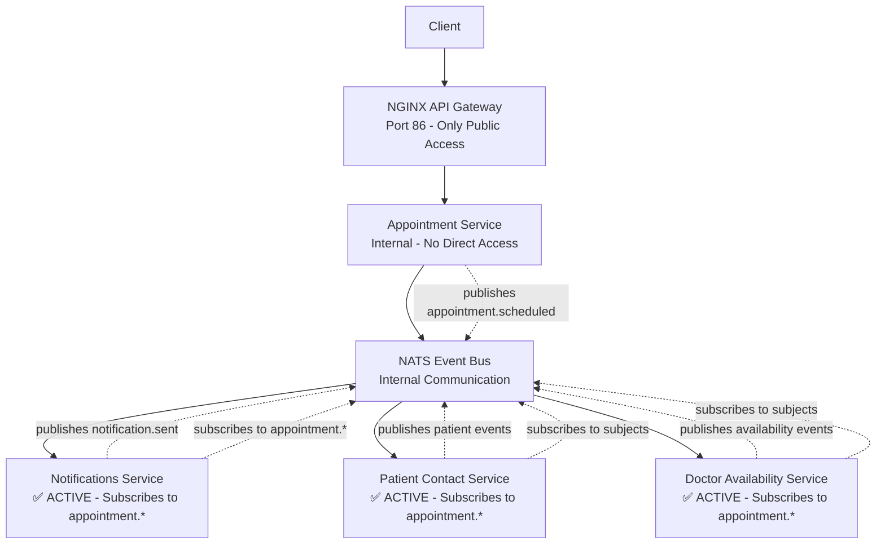

# Healthcare Appointment Scheduling - EDA Microservices

A progressive Event-Driven Architecture (EDA) microservices application for healthcare appointment scheduling, built with pure choreography pattern.

## 🎯 Current Phase: Phase 5 - Doctor Availability Service & Full Choreography ✅ COMPLETE

### What's Implemented
- ✅ **Phase 1**: Complete appointment management with REST endpoints
- ✅ **Phase 2**: NATS Event Bus with pure choreography pattern
- ✅ **Phase 2.5**: NGINX API Gateway as single public entry point on port 86
- ✅ **Phase 3**: Notifications microservice with event subscription and processing
- ✅ **Phase 4**: Patient Contact Service with event-driven patient management
- ✅ **Phase 5**: Doctor Availability Service with scheduling conflict management
- ✅ **Full Choreography**: Appointment Service → NATS → All Services (Notifications + Patient + Doctor)
- ✅ **Event Chain**: `appointment.scheduled` → `notification.sent` + Patient tracking + Availability blocking
- ✅ **Complete Microservices Ecosystem**: 4 services working together via events

### Tech Stack
- **FastAPI**: Modern Python web framework
- **NATS**: High-performance event streaming
- **Pydantic**: Data validation and event schemas
- **Docker**: Containerization with AWS ECR base images
- **NGINX**: API Gateway for routing
- **Uvicorn**: ASGI server

## 🏗️ Corrected Microservices Architecture



## 🚀 Quick Start

### Prerequisites
- Docker & Docker Compose

### Run the Services
```bash
cd kiloem
docker compose up --build
```

### Services Available
- **NGINX API Gateway**: `http://localhost:86` (single public entry point)
- **NATS Server**: `localhost:4222` (client), `localhost:8222` (monitoring)
- **All microservices are internal only** - accessed via NGINX

### API Endpoints
All requests go through NGINX gateway and are routed to appropriate services:

#### Create Appointment (publishes `appointment.scheduled` event)
```bash
curl -X POST http://localhost:86/appointments \
  -H "Content-Type: application/json" \
  -d '{
    "patient_id": "patient-123",
    "doctor_id": "doctor-456",
    "appointment_time": "2025-09-15T10:00:00Z",
    "duration_minutes": 30,
    "notes": "Regular checkup"
  }'
```

#### List Appointments
```bash
curl http://localhost:86/appointments
```

#### Get Specific Appointment
```bash
curl http://localhost:86/appointments/{appointment_id}
```

#### Update Appointment (publishes `appointment.updated` event)
```bash
curl -X PUT http://localhost:86/appointments/{appointment_id} \
  -H "Content-Type: application/json" \
  -d '{"status": "confirmed"}'
```

#### Cancel Appointment (publishes `appointment.cancelled` event)
```bash
curl -X DELETE http://localhost:86/appointments/{appointment_id}
```

#### Get Patient Appointments
```bash
curl http://localhost:86/appointments/patient/{patient_id}
```

#### Get Doctor Appointments
```bash
curl http://localhost:86/appointments/doctor/{doctor_id}
```

## 🎭 Event Flow
Each API operation publishes events to NATS subjects:
- `appointment.scheduled` - When appointment is created
- `appointment.updated` - When appointment is modified
- `appointment.cancelled` - When appointment is cancelled

Other services can subscribe to these subjects and react accordingly.

## 📁 Project Structure
```
kiloem/
├── appointment-service/
│   ├── main.py              # FastAPI application with NATS integration
│   ├── requirements.txt     # Python dependencies (includes nats-py)
│   └── Dockerfile          # Docker configuration (AWS ECR base image)
├── notifications-service/
│   ├── main.py              # Event-driven notification processor
│   ├── requirements.txt     # Python dependencies
│   └── Dockerfile          # Docker configuration
├── patient-service/
│   ├── main.py              # Patient contact management with event processing
│   ├── requirements.txt     # Python dependencies
│   └── Dockerfile          # Docker configuration
├── doctor-service/
│   ├── main.py              # Doctor availability management with scheduling conflicts
│   ├── requirements.txt     # Python dependencies
│   └── Dockerfile          # Docker configuration
├── nginx.conf              # NGINX API Gateway configuration
├── docker-compose.yml      # Multi-service orchestration
└── README.md              # This file
```

## 🎯 Learning Goals - Phase 3 ✅ ACHIEVED
This phase focuses on:
- **Event Consumption**: Services subscribing to and processing events ✅
- **Cross-Service Communication**: Event-driven service interactions ✅
- **Notification Processing**: Real-time notification generation ✅
- **Event Publishing Chain**: Services publishing their own events ✅
- **Complete Choreography**: End-to-end event-driven workflow ✅

## 🎭 Live Choreography Demonstration
The complete event flow is working! When you create an appointment:

**1. Client Request:**
```bash
curl -X POST http://localhost:86/appointments -H "Content-Type: application/json" -d '{"patient_id": "patient-123", "doctor_id": "doctor-456", "appointment_time": "2025-09-15T10:00:00Z"}'
```

**2. Event Flow Logs:**
```
✅ Appointment Service: "Published event: appointment.scheduled"
✅ NATS Server: "[PUB appointment.scheduled 354]" + "[MSG appointment.scheduled 1 354]"
✅ Notifications Service: "📧 Notification sent to patient patient-123: Your appointment with Dr. doctor-456 is scheduled for 2025-09-15 10:00."
✅ NATS Server: "[PUB notification.sent 387]"
```

**3. Complete Event Chain:**
`appointment.scheduled` → `notification.sent`

This demonstrates **pure choreography** - services autonomously reacting to events without direct coupling!

## 🔄 Next Phase Preview
Phase 3 will introduce:
- **Notifications Microservice**: Subscribe to `appointment.*` events
- **Event Consumption**: Process notifications when appointments are created/updated
- **Cross-Service Publishing**: Publish `notification.sent` events
- **Complete Choreography**: First service reacting to published events

## 📚 API Documentation
Once running, visit: `http://localhost:86/docs` for interactive Swagger documentation.

## 🔍 NATS Monitoring
Visit `http://localhost:8222` to monitor NATS server and view published events.