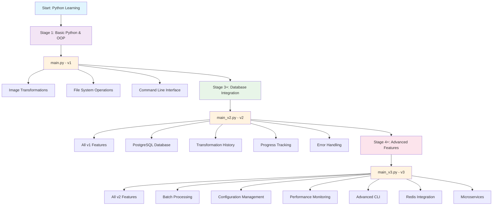
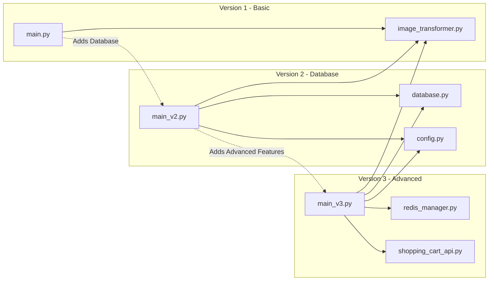
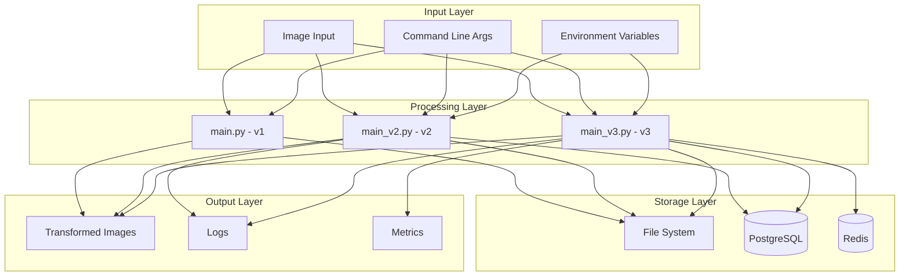
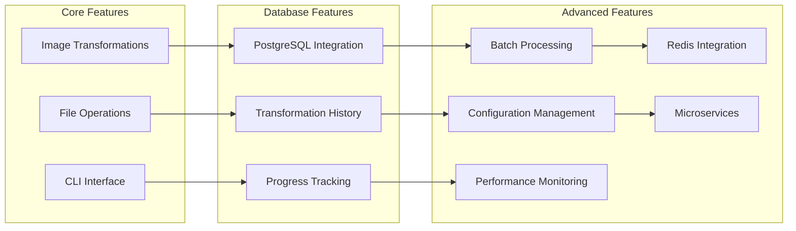
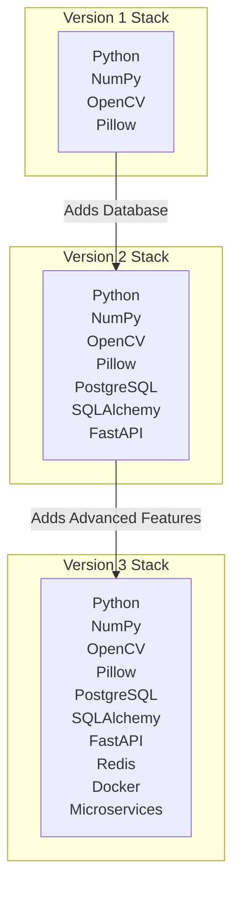

# Version Progression Flowchart

## Learning Progression Overview



## Detailed Version Architecture



## Data Flow Architecture



## Feature Evolution



## Technology Stack Evolution



## Learning Path

```mermaid
journey
    title Learning Progression
    section Stage 1: Basic Python
      Learn OOP: 5: User
      Image Processing: 4: User
      File Operations: 3: User
    section Stage 2: Database Integration
      PostgreSQL: 5: User
      SQLAlchemy: 4: User
      Environment Variables: 3: User
    section Stage 3: Advanced Features
      Batch Processing: 5: User
      Configuration Management: 4: User
      Performance Monitoring: 3: User
      Microservices: 2: User
```
