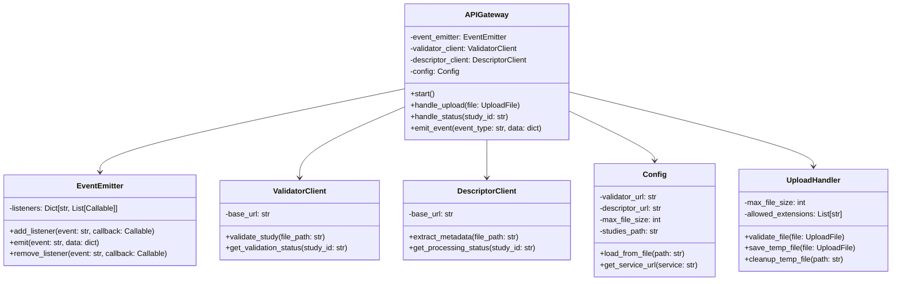
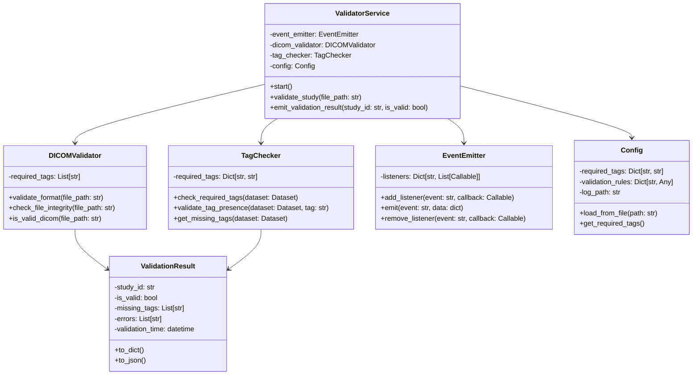
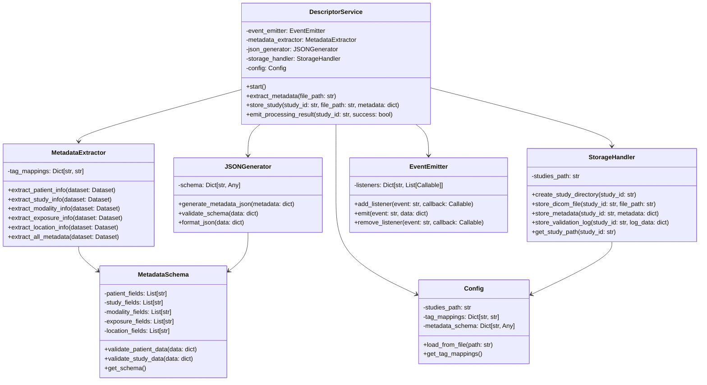
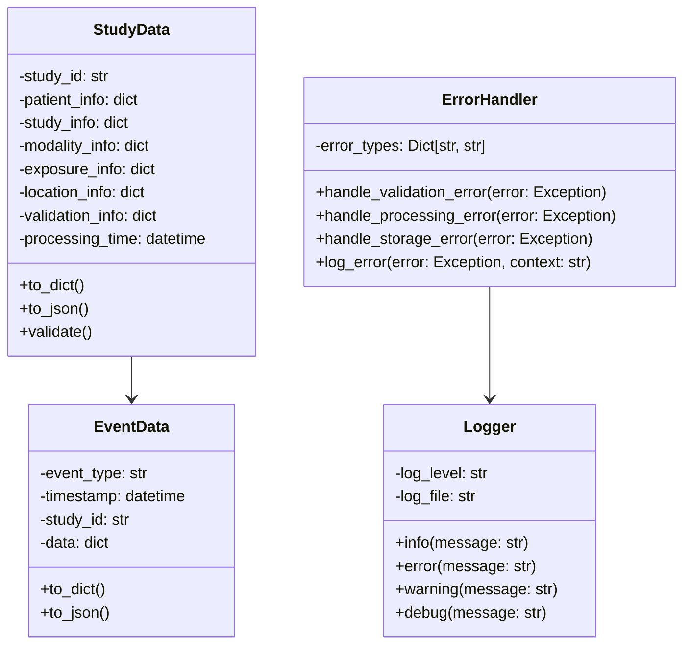
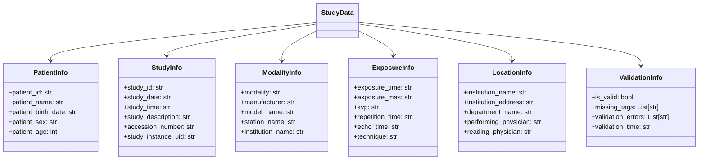

# PACS DICOM Study Validator - Class Diagram

## API Gateway Service Classes

```mermaid
classDiagram
    class APIGateway {
        -event_emitter: EventEmitter
        -validator_client: ValidatorClient
        -descriptor_client: DescriptorClient
        -config: Config
        +start()
        +handle_upload(file: UploadFile)
        +handle_status(study_id: str)
        +emit_event(event_type: str, data: dict)
    }

    class UploadHandler {
        -max_file_size: int
        -allowed_extensions: List[str]
        +validate_file(file: UploadFile)
        +save_temp_file(file: UploadFile)
        +cleanup_temp_file(path: str)
    }

    class EventEmitter {
        -listeners: Dict[str, List[Callable]]
        +add_listener(event: str, callback: Callable)
        +emit(event: str, data: dict)
        +remove_listener(event: str, callback: Callable)
    }

    class ValidatorClient {
        -base_url: str
        +validate_study(file_path: str)
        +get_validation_status(study_id: str)
    }

    class DescriptorClient {
        -base_url: str
        +extract_metadata(file_path: str)
        +get_processing_status(study_id: str)
    }

    class Config {
        -validator_url: str
        -descriptor_url: str
        -max_file_size: int
        -studies_path: str
        +load_from_file(path: str)
        +get_service_url(service: str)
    }

    APIGateway --> EventEmitter
    APIGateway --> ValidatorClient
    APIGateway --> DescriptorClient
    APIGateway --> Config
    APIGateway --> UploadHandler
```

## Validator Service Classes

```mermaid
classDiagram
    class ValidatorService {
        -event_emitter: EventEmitter
        -dicom_validator: DICOMValidator
        -tag_checker: TagChecker
        -config: Config
        +start()
        +validate_study(file_path: str)
        +emit_validation_result(study_id: str, is_valid: bool)
    }

    class DICOMValidator {
        -required_tags: List[str]
        +validate_format(file_path: str)
        +check_file_integrity(file_path: str)
        +is_valid_dicom(file_path: str)
    }

    class TagChecker {
        -required_tags: Dict[str, str]
        +check_required_tags(dataset: Dataset)
        +validate_tag_presence(dataset: Dataset, tag: str)
        +get_missing_tags(dataset: Dataset)
    }

    class ValidationResult {
        -study_id: str
        -is_valid: bool
        -missing_tags: List[str]
        -errors: List[str]
        -validation_time: datetime
        +to_dict()
        +to_json()
    }

    class EventEmitter {
        -listeners: Dict[str, List[Callable]]
        +add_listener(event: str, callback: Callable)
        +emit(event: str, data: dict)
        +remove_listener(event: str, callback: Callable)
    }

    class Config {
        -required_tags: Dict[str, str]
        -validation_rules: Dict[str, Any]
        -log_path: str
        +load_from_file(path: str)
        +get_required_tags()
    }

    ValidatorService --> EventEmitter
    ValidatorService --> DICOMValidator
    ValidatorService --> TagChecker
    ValidatorService --> Config
    DICOMValidator --> ValidationResult
    TagChecker --> ValidationResult
```

## Descriptor Service Classes

```mermaid
classDiagram
    class DescriptorService {
        -event_emitter: EventEmitter
        -metadata_extractor: MetadataExtractor
        -json_generator: JSONGenerator
        -storage_handler: StorageHandler
        -config: Config
        +start()
        +extract_metadata(file_path: str)
        +store_study(study_id: str, file_path: str, metadata: dict)
        +emit_processing_result(study_id: str, success: bool)
    }

    class MetadataExtractor {
        -tag_mappings: Dict[str, str]
        +extract_patient_info(dataset: Dataset)
        +extract_study_info(dataset: Dataset)
        +extract_modality_info(dataset: Dataset)
        +extract_exposure_info(dataset: Dataset)
        +extract_location_info(dataset: Dataset)
        +extract_all_metadata(dataset: Dataset)
    }

    class JSONGenerator {
        -schema: Dict[str, Any]
        +generate_metadata_json(metadata: dict)
        +validate_schema(data: dict)
        +format_json(data: dict)
    }

    class StorageHandler {
        -studies_path: str
        +create_study_directory(study_id: str)
        +store_dicom_file(study_id: str, file_path: str)
        +store_metadata(study_id: str, metadata: dict)
        +store_validation_log(study_id: str, log_data: dict)
        +get_study_path(study_id: str)
    }

    class MetadataSchema {
        -patient_fields: List[str]
        -study_fields: List[str]
        -modality_fields: List[str]
        -exposure_fields: List[str]
        -location_fields: List[str]
        +validate_patient_data(data: dict)
        +validate_study_data(data: dict)
        +get_schema()
    }

    class EventEmitter {
        -listeners: Dict[str, List[Callable]]
        +add_listener(event: str, callback: Callable)
        +emit(event: str, data: dict)
        +remove_listener(event: str, callback: Callable)
    }

    class Config {
        -studies_path: str
        -tag_mappings: Dict[str, str]
        -metadata_schema: Dict[str, Any]
        +load_from_file(path: str)
        +get_tag_mappings()
    }

    DescriptorService --> EventEmitter
    DescriptorService --> MetadataExtractor
    DescriptorService --> JSONGenerator
    DescriptorService --> StorageHandler
    DescriptorService --> Config
    MetadataExtractor --> MetadataSchema
    JSONGenerator --> MetadataSchema
    StorageHandler --> Config
```

## Shared Classes

```mermaid
classDiagram
    class StudyData {
        -study_id: str
        -patient_info: dict
        -study_info: dict
        -modality_info: dict
        -exposure_info: dict
        -location_info: dict
        -validation_info: dict
        -processing_time: datetime
        +to_dict()
        +to_json()
        +validate()
    }

    class EventData {
        -event_type: str
        -timestamp: datetime
        -study_id: str
        -data: dict
        +to_dict()
        +to_json()
    }

    class ErrorHandler {
        -error_types: Dict[str, str]
        +handle_validation_error(error: Exception)
        +handle_processing_error(error: Exception)
        +handle_storage_error(error: Exception)
        +log_error(error: Exception, context: str)
    }

    class Logger {
        -log_level: str
        -log_file: str
        +info(message: str)
        +error(message: str)
        +warning(message: str)
        +debug(message: str)
    }

    StudyData --> EventData
    ErrorHandler --> Logger
```

## Data Models

```mermaid
classDiagram
    class PatientInfo {
        +patient_id: str
        +patient_name: str
        +patient_birth_date: str
        +patient_sex: str
        +patient_age: int
    }

    class StudyInfo {
        +study_id: str
        +study_date: str
        +study_time: str
        +study_description: str
        +accession_number: str
        +study_instance_uid: str
    }

    class ModalityInfo {
        +modality: str
        +manufacturer: str
        +model_name: str
        +station_name: str
        +institution_name: str
    }

    class ExposureInfo {
        +exposure_time: str
        +exposure_mas: str
        +kvp: str
        +repetition_time: str
        +echo_time: str
        +technique: str
    }

    class LocationInfo {
        +institution_name: str
        +institution_address: str
        +department_name: str
        +performing_physician: str
        +reading_physician: str
    }

    class ValidationInfo {
        +is_valid: bool
        +missing_tags: List[str]
        +validation_errors: List[str]
        +validation_time: str
    }

    StudyData --> PatientInfo
    StudyData --> StudyInfo
    StudyData --> ModalityInfo
    StudyData --> ExposureInfo
    StudyData --> LocationInfo
    StudyData --> ValidationInfo
```
