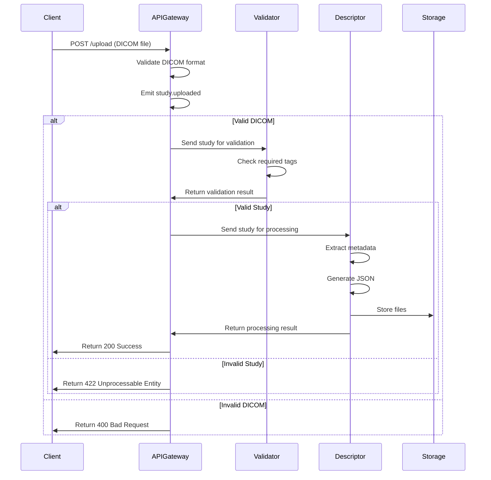
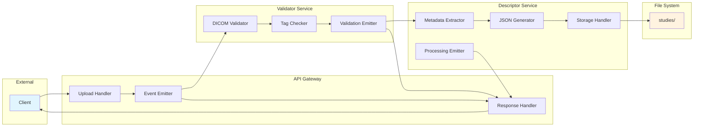

# PACS DICOM Study Validator - Flow Diagram

```mermaid
flowchart TD
    A[Client Upload] --> B[API Gateway]
    B --> C{Validate DICOM Format}

    C -->|Invalid| D[Return 400 Bad Request]
    C -->|Valid| E[Emit study.uploaded]

    E --> F[Validator Service]
    F --> G{Check Required Tags}

    G -->|Missing Tags| H[Emit validation.failed]
    G -->|All Tags Present| I[Emit validation.success]

    H --> J[Return 422 Unprocessable Entity]
    I --> K[Descriptor Service]

    K --> L[Extract Metadata]
    L --> M[Generate JSON]
    M --> N[Store Files]

    N --> O[Emit metadata.extracted]
    O --> P[Emit storage.completed]
    P --> Q[Emit study.processed]

    Q --> R[Return 200 Success]

    subgraph "API Gateway"
        B
        C
        E
        Q
        R
    end

    subgraph "Validator Service"
        F
        G
        H
        I
    end

    subgraph "Descriptor Service"
        K
        L
        M
        N
        O
        P
    end

    subgraph "Storage"
        S[studies/{study_id}/]
        T[original.dcm]
        U[metadata.json]
        V[validation.log]
    end

    N --> S
    S --> T
    S --> U
    S --> V

    style A fill:#e1f5fe
    style R fill:#c8e6c9
    style J fill:#ffcdd2
    style D fill:#ffcdd2
```

## Event Flow Sequence



## Service Communication Flow


